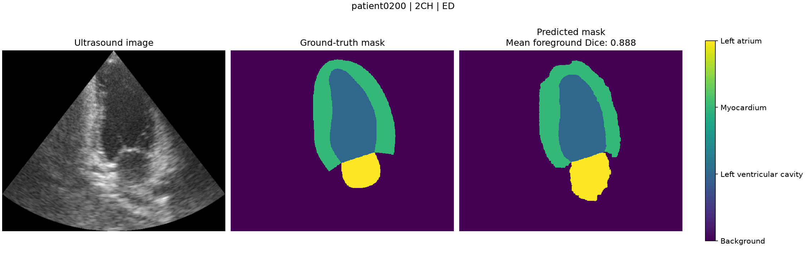

# CAMUS 2D Echocardiography Segmentation

An end-to-end PyTorch U-Net baseline for segmenting the left ventricular
cavity, myocardium, and left atrium in 2D echocardiography from the CAMUS
dataset.

This project was developed incrementally to make the complete pipeline
explainable: patient-level data splitting, NIfTI loading, tensor shapes, U-Net
forward propagation, loss calculation, backpropagation, CUDA training,
checkpoint selection, and held-out evaluation.

> This implementation is an educational research project and is not a clinical
> system. Use of CAMUS data remains subject to its non-commercial research
> terms.

## Results

The reported model is the checkpoint with the highest mean foreground Dice on
the validation split. It was then evaluated on the held-out test split without
further model selection.

| Metric | Validation | Test |
|---|---:|---:|
| Dice + CrossEntropy loss | 0.309221 | 0.308204 |
| Left ventricular cavity Dice | 0.9138 | 0.9089 |
| Myocardium Dice | 0.8206 | 0.8199 |
| Left atrium Dice | 0.8560 | 0.8598 |
| Mean foreground Dice | 0.8635 | **0.8629** |

Dice is calculated separately for each image and foreground class, averaged
across all images, and then averaged across the three foreground classes.
Background is excluded from the reported mean.

### Qualitative validation example



The example shows `patient0200`, the two-chamber view at end-diastole. Its mean
foreground Dice is 0.8881. The figure is a qualitative example; the table above
contains the full validation and test results.

## Dataset and task

CAMUS contains 500 patients. This project uses four annotated frames per
patient: two-chamber and four-chamber views at end-diastole and end-systole.

| Split | Patients | Annotated images |
|---|---:|---:|
| Training | 400 | 1,600 |
| Validation | 50 | 200 |
| Test | 50 | 200 |

The split is patient-level, so no patient appears in more than one subset. The
four segmentation labels are:

| Label | Structure |
|---:|---|
| 0 | Background |
| 1 | Left ventricular cavity |
| 2 | Myocardium |
| 3 | Left atrium |

The CAMUS data is not redistributed by this repository. Access instructions are
available from the
[official CAMUS dataset page](https://www.creatis.insa-lyon.fr/Challenge/camus/databases.html).
After accepting the dataset terms, place the patient directories under:

```text
data/raw/camus/patient0001/
...
data/raw/camus/patient0500/
```

## Model

The model is a four-level 2D U-Net implemented directly with PyTorch:

```text
Input: 1 x 512 x 416
Encoder channels: 32 -> 64 -> 128 -> 256
Bottleneck channels: 512
Decoder channels: 256 -> 128 -> 64 -> 32
Output: 4 x 512 x 416 logits
```

Each encoder and decoder block contains two `3 x 3` convolutions, each followed
by ReLU. Four `2 x 2` max-pooling operations reduce spatial resolution, and
transposed convolutions restore it. Skip connections concatenate encoder
features with decoder features at matching resolutions. A final `1 x 1`
convolution produces one logit map per class.

The model has **7,759,620 trainable parameters**.

## Training configuration

| Setting | Value |
|---|---|
| Input size | `512 x 416` |
| Image resize | Bilinear interpolation |
| Mask resize | Nearest-neighbor interpolation |
| Image normalization | Divide intensity values by 255 |
| Data augmentation | None for this baseline |
| Loss | CrossEntropy + foreground Soft Dice loss |
| Optimizer | AdamW |
| Learning rate | `1e-3` |
| Weight decay | `1e-4` |
| Batch size | 8 |
| Epochs | 10 |
| Checkpoint selection | Highest validation mean foreground Dice |
| Training GPU | NVIDIA GeForce RTX 4090 |

The best checkpoint is written to
`outputs/checkpoints/best_model.pt`. Generated checkpoints remain local and are
excluded from Git. Each checkpoint also records the training configuration used
to create it.

## Reproduce the baseline

Install [`uv`](https://docs.astral.sh/uv/), clone the repository, and reproduce
the locked Python 3.12 environment:

```bash
uv sync --locked
```

Train the model with the baseline configuration:

```bash
uv run --frozen python -m camus_segmentation.train \
  --epochs 10 \
  --batch-size 8 \
  --learning-rate 1e-3 \
  --weight-decay 1e-4
```

These values are the defaults, so the shorter command without flags produces
the same configuration. Use `--help` to list the four training options.

Evaluate the selected checkpoint on the held-out test split:

```bash
uv run --frozen python -m camus_segmentation.evaluate_test
```

Generate the qualitative validation figure:

```bash
uv run --frozen python -m camus_segmentation.visualize_prediction
```

The project uses PyTorch 2.12.1 with its prebuilt CUDA 13.2 runtime. A compatible
NVIDIA driver is required for GPU execution. A system CUDA Toolkit and `nvcc`
are not required because the project does not compile custom CUDA code.

## Repository layout

```text
dl-segmentation-camus/
├── camus_segmentation/
│   ├── data.py                  # CAMUS sample discovery and tensor loading
│   ├── model.py                 # Four-level 2D U-Net
│   ├── loss.py                  # CrossEntropy + Soft Dice loss
│   ├── metrics.py               # Hard foreground Dice metric
│   ├── evaluation.py            # Shared validation and test loop
│   ├── train.py                 # Training and best-checkpoint selection
│   ├── evaluate_test.py         # Held-out test evaluation
│   └── visualize_prediction.py  # Single-image qualitative inference
├── data/
│   ├── raw/camus/               # Local CAMUS data; never committed
│   └── splits/                  # Patient-level split files
├── docs/
│   ├── assets/                  # Curated README figures
│   └── adr/                     # Architecture decision records
├── notebooks/
│   └── 01_understand_camus_dataset.ipynb
├── outputs/                     # Local checkpoints; never committed
├── CAMUS_LICENSE.md
├── pyproject.toml
└── uv.lock
```

The notebook is the learning workspace; `camus_segmentation/` contains the
formal reusable implementation. Additional explanations are available in the
[project glossary](docs/glossary.md) and the
[CUDA runtime decision record](docs/adr/0001-cuda-runtime-strategy.md).

## Current limitations

- Results come from one fixed patient split and one training run.
- No data augmentation or learning-rate schedule is used.
- Exact deterministic seeds and repeated-run variance are not yet reported.
- The model has not been evaluated on an external dataset.
- The results do not establish clinical validity or state-of-the-art
  performance.

## Dataset citation and terms

Any use of the CAMUS database must cite:

> S. Leclerc, E. Smistad, J. Pedrosa, A. Ostvik, et al. “Deep Learning for
> Segmentation using an Open Large-Scale Dataset in 2D Echocardiography.” IEEE
> Transactions on Medical Imaging, 38(9), 2198–2210, 2019.
> https://doi.org/10.1109/TMI.2019.2900516

See [CAMUS_LICENSE.md](CAMUS_LICENSE.md) for the local copy of the dataset
terms. The dataset is subject to CC BY-NC-SA 4.0 and additional CAMUS terms.
