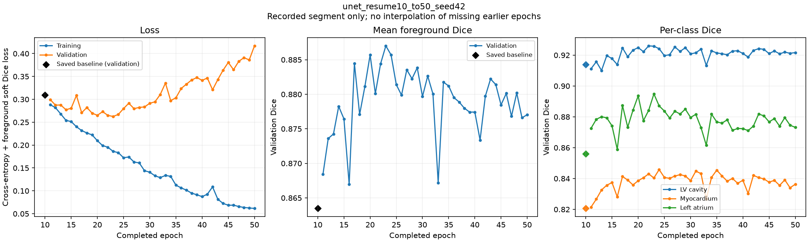

# 实验登记：不要把旧基线和新续训混在一起

## 1. 已冻结的手写 U-Net 10 epoch 基线

- 原始路径：`outputs/checkpoints/best_model.pt`（为旧 notebook 保留，不再作为新训练输出）。
- 冻结副本：`outputs/baselines/unet_10ep/best.pt`（只读副本）。
- SHA-256：`8c4495b60647e49ede8c315c6c703f5893485938a89e282ac8e9b7f618afe78d`。
- 保存 epoch：10；AdamW state 中更新次数：2000。
- 保存的验证平均前景 Dice：`0.8634774088859558`。
- 已独立核验的测试平均前景 Dice：`0.8628640993226364`。
- 评估网格：`512 × 416`；按图、按前景类计算 Dice，再取平均；不含背景。
- 旧 checkpoint 保存了 model + optimizer + config，但没有 RNG 状态；未找到可完整重建 epoch 1–10 的训练曲线。不要补造缺失记录。

## 2. nnU-Net v2 2D 参考

- 工作区：`data/nnunet/`，单折 fold 0；已有训练和测试预测不重跑、不搬动。
- 名义训练预算：1000 个固定迭代 epoch，每轮 250 optimizer updates。
- 已独立复算的测试平均前景 Dice：`0.9201659658868531`。
- 评估网格：原始图像网格；与手写模型不是统一空间的架构消融。
- checkpoint 选择统计量、增强、优化器、预处理与训练预算均不同。

## 3. 本次手写 U-Net 续训结果（已完成）

**2026-09-20 已完成累计50轮。核对了40行真实记录（epoch11–50）、最后checkpoint的10000次更新以及最佳checkpoint的epoch23 / 4600次更新。独立加载最佳模型重新评估50位验证患者、200张图，结果与训练记录一致。**

| 验证集指标 | 原10轮基线 | 本次最佳（第23轮） |
|---|---:|---:|
| 左心室腔 Dice | 0.9138 | 0.9258 |
| 心肌 Dice | 0.8206 | 0.8404 |
| 左心房 Dice | 0.8560 | 0.8949 |
| 平均前景 Dice | 0.8635 | **0.8870** |

平均前景验证 Dice 增加 **2.3530 个百分点**。本次没有评估测试集，不能与历史测试分数0.8629混用。

第50轮验证平均 Dice 为 **0.8770**，低于第23轮；同期间训练loss由0.1863降至0.0616，验证loss由0.2625升至0.4169。这组趋势与后期过拟合一致，不支持简单继续堆轮数。

可版本化证据：[完整指标与来源JSON](results/unet_resume10_to50.json) · [逐轮CSV](results/unet_resume10_to50_history.csv)。曲线和指标随代码版本化，权重和原始数据仍保留在Git忽略目录。发布版本以Git提交记录为准；结果JSON中的代码标识记录的是训练时的工作区，而不是后续发布提交。

### 固定设置与产物

- 实验目录：`outputs/runs/unet_resume10_to50_seed42/`。
- 保留原epoch10，恢复模型与AdamW；本段执行40轮，累计目标50轮。
- 模型、loss、batch8、lr`1e-3`、weight decay`1e-4`、输入`512×416`、无增强/无scheduler/无AMP保持不变。
- Seed42仅用于缺失旧RNG后的续训阶段；新checkpoint保存RNG，不声称原10轮使用此seed。
- `baseline.pt`：原epoch10；`best.pt`：验证最优epoch23；`last.pt`：epoch50完整状态。
- `history.csv`只包含实际记录的epoch11–50，旧epoch10验证指标单独保存和绘制。
- 训练前47项测试通过，训练逻辑通过独立审查；原权重SHA256未变，执行代码hash与启动记录一致。
- 每轮训练+验证计时累计约16.05分钟，不含全部保存与启动开销。

## 4. 结果解释边界

这次回答“从现有权重继续训练是否改善验证表现”。它不是从头固定 seed 连续跑 50 轮的严格复现，因为原 RNG 状态缺失；也不是多 seed 稳定性结论。

本次验证最佳为epoch23，而不是最后一轮。延长训练初期带来验证收益，但后期没有继续改善；验证分数提高不等于测试必然提高。模型与预算选择不依据测试集追分。

现有测试病例已做过描述性失败分析。若未来用这些病例反复调参，需明确探索性性质，并寻求独立验证。

## 5. 文件来源

旧指标来源为本地独立审查的 `verified_metrics.json`（2026-09-19）和冻结checkpoint；新指标来自本次run的history、summary、best/last checkpoint及独立validation.json复算，并导出至上方docs/results。

操作与文件含义见 [training.md](training.md)。
